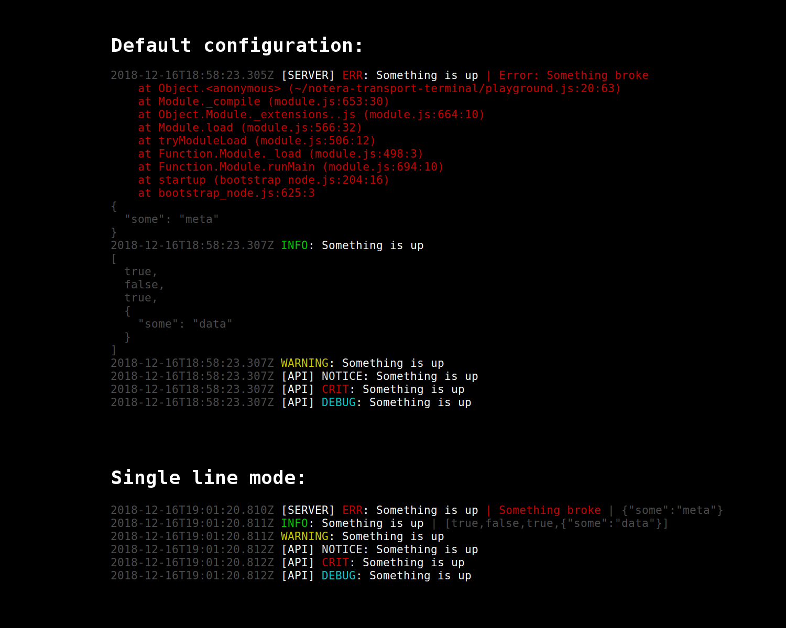

# Notera Terminal Transport

This package provides a customizable terminal transport for the
[Notera](https://github.com/zappen999/notera) package. This transport
atomically writes to stdout like console.log, which makes it ideal for
development purposes.

[](https://travis-ci.org/zappen999/notera-transport-terminal)
[](https://coveralls.io/github/zappen999/notera-transport-terminal?branch=master)



## Usage

**Example usage with Notera:**

```js
const Notera = require('notera')
const noteraTransportTerminal = require('notera-transport-terminal')

const logger = new Notera()

logger.addTransport(noteraTransportTerminal({
  // Options
}))

// Use logger as usual
logger.ctx('SERVER').info('Something is up', { some: 'meta' })
```

## Options

### Terminology

- **Segment** - Each logging line can be divided into segments, for example
  `time`, `ctx`, `msg`, `level`, `meta`, `err`.
- **Entry** - A logging entry generated by a call to one of the log functions in
  the Notera package.

```ts
interface Options {
  // Disable colored/styled output. Defaults to false
  disableStyle?: bool;

  // Never use more than one line for one log entry. This will hide stack traces
  // when logging errors, and only show the message instead. Defaults to false
  singleLine?: bool;

  // Colors that the default style functions use. Please refer to the "Colors"
  // section for more info. Defaults to:
  // emerg:   red
  // alert:   magenta
  // crit:    red
  // err:     red
  // warning: yellow
  // notice:  white
  // info:    green
  // debug:   cyan
  colors?: [level: string]: Color;

  // Configuration used when handling each segment. Please see the section
  // "Configuring segments" for more information on how to configure these.
  segments?: [segmentName: string]: SegmentConfig;
}

interface SegmentConfig {
  // How this segment should be ordered amongst the other
  index: number;

  // Function to format the segment
  format?: (entry: NoteraLogEntry, opts: Options) => string;

  // Function to determine the color of this segment this specific log entry.
  // Use a simple string (Color) if you don't need dynamic coloring.
  style?: Color | (entry: NoteraLogEntry, opts: Options) => Color;
}
```

### Configuring segments

The default print format and style like the image in the top of this readme,
is accomplished with a configuration that looks like this:

```js
{
  disableStyle: false,
  singleLine: false,
  colors: {
    emerg: 'red',
    alert: 'magenta',
    crit: 'red',
    err: 'red',
    warning: 'yellow',
    notice: 'white',
    info: 'green',
    debug: 'cyan'
  },
  segment: {
    time: {
      index: 10,
      format: _ => new Date().toISOString(),
      style: 'gray'
    },
    ctx: {
      index: 20,
      format: ({ ctx }) => ` [${ctx}]`
    },
    level: {
      index: 30,
      style: ({ level }, opts) => opts.colors[level],
      format: ({ level }) => ' ' + level.toUpperCase()
    },
    msg: {
      index: 40,
      format: ({ msg }) => `: ${msg}`
    },
    err: {
      index: 50,
      format: ({ err }, opts) => ` | ${opts.singleLine ? err.message : err.stack}`,
      style: 'red'
    },
    meta: {
      index: 60,
      format: ({ meta }, opts) =>
        ` | ${JSON.stringify(meta, ...(opts.singleLine ? [] : [null, 2]))}`,
      style: 'gray'
    }
  }
}
```

#### Changing a segment

To change segment settings, you can simply overwrite them. Note that the
settings will be merged with the default settings at feature-level. See the
configuration examples below.

```js
const config = {
  // ...
  segment: {
    ctx: {
      // Turns off formatting for the 'ctx' segment. Resulting in a simple
      // append from the previous segment.
      format: null,

      // Reset the default style of the 'ctx' segment
      style: null,

      // Reorder the 'ctx' segment to be placed after all other segments
      index: 100
    },
  }
}
```


#### Adding a custom segment

You can add totally custom segment that are evaluated on every log entry.
Example:

```js
const config = {
  // ...
  segment: {
    // Include the current memory usage in each log entry
    memory: {
      index: 15,
      format: () => ` MEM ${Math.round(os.freemem() / 1024 / 1024)} MiB`
    }
  }
}
```

#### Disable a segment

To disable a segment you can set the segment config to `null`:

```js
const config = {
  // ...
  segment: {
    ctx: null
  }
}
```

### Colors

This package is using [ansi-styles](https://github.com/chalk/ansi-styles) under
the hood to colorize the terminal output. Please refer to their readme to see
what colors are available.

## Installation
- `npm install notera-transport-terminal`
- `yarn add notera-transport-terminal`
